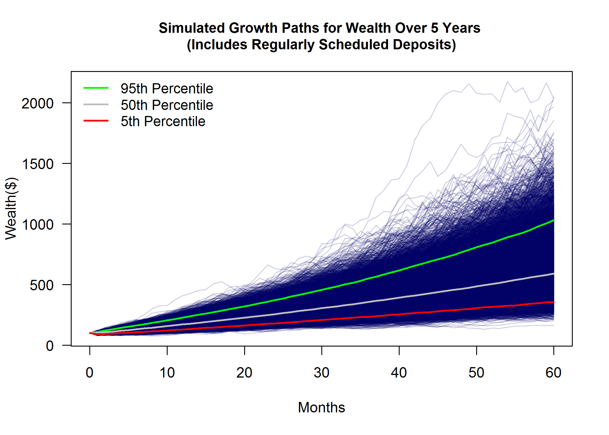

Introduction
---

In this document, I present a more detailed analysis regarding a question that was asked of me by Lisa Huang, Senior Quantitative Portfolio Analyst and Investment Team Member at Betterment, during my technical phone screening. The question, as I understood it, was with respect to how I would analyze the risk associated with the long-term growth in wealth assuming that there is a constant and regularly scheduled deposit amount over time. There are 2 dynamics for wealth that I want to model in this analysis: 1) wealth should tend to rise over time as why would anyone invest otherwise and 2) uncertainty in wealth should also increase over time. The analysis presented here shows how we can make specific assumptions on the distribution of returns on the portfolio over time and apply Monte Carlo simulation to model these dynamics. Below, I discuss my assumptions, approach and results. 

Methodology and Results
---

I initially planned to come up with an analytical solution, but even after making simplifying assumptions regarding the specific form of the random process followed by the returns on the portfolio (as described below), my algebra started to get really messy (at least for me, dealing with the fixed deposits proved to be a nuisance). While I am sure there are those more clever than me who would have succeeded in deriving an analytical solution, I decided to make life easier for myself by developing an approach based on Monte Carlo simulation. Before I describe the solution in more depth, I should be clear on the assumptions first.

* The term for the analysis is 5 years and I assume that time intervals are discretized monthly. Thus the length of the period of the analysis is 60 months. 

* Returns follow a Geometric Brownian Motion (log-normal) process. The form of and solution to this Stochastic Differential Equation is well-known. For more information, please consult <https://en.wikipedia.org/wiki/Geometric_Brownian_motion>.

* The parameters for the log-normal process are defined as follows:
    + ${\boldsymbol \mu}$ = 0.14 (the annual drift parameter)
    + ${\boldsymbol \sigma}$ = 0.20 (the annual percentage volatility)
    
* Initial value of wealth (portfolio) = $100.

* Fixed monthly deposit amount = $5. Deposits do not begin until the end of period 1 (i.e., end of the first month. 

Given the assumption on the stochastic process that returns follow, wealth follows a log-normal geometric random walk with drift. We can simulate this process via Monte Carlo simulation while accounting for the regularly scheduled deposits in a straight forward manner. I employ this approach in Figure 1, where I generate 15,000 possible paths for wealth[^1]. Wealth does trend upwards over time, but the dispersion in the randomly generated paths also increases over time. The model therefore captures the desired,  economically intuitive properties.     

[^1]: Please see the R script __endOfPeriodWealth.R__ for details. 

At the end of each time period (month) ${t}$ where $${t}=\begin{matrix} 1 & 2 & \cdots & 60\end{matrix}$$ we have a distribution for wealth levels. To underscore the points previously made, I calculate the 95%, 50% and 5% quantiles for wealth at the end of each month. Plotting these quantiles over time helps to better illustrate uncertainty in wealth growth by showing what it means for the portfolio to perform well (95th percentile), poorly (5th percentile), or in more typical fashion (50th percentile) at any given point in time over the 60-month horizon.            

**Figure 1. Growth and Uncertainty in Wealth Over Time**

Conclusions
---

All investors need to understand that there is inherent uncertainty in how your wealth grows over time. By making the simplifying assumption that returns on your portfolio are generated by a Geometic Brownian Motion process, we find that wealth behaves in accordance with a log-normal geometric random walk with drift. Modeling the growth in wealth in this fashion leads to economically intuitive properties where wealth tends to increase over time with uncertainty in wealth also rising alongside. With Monte Carlo simulation, we can generate thousands of random paths for wealth in accordance with this model and quantify the uncertainty in wealth growth over time.           

                 

